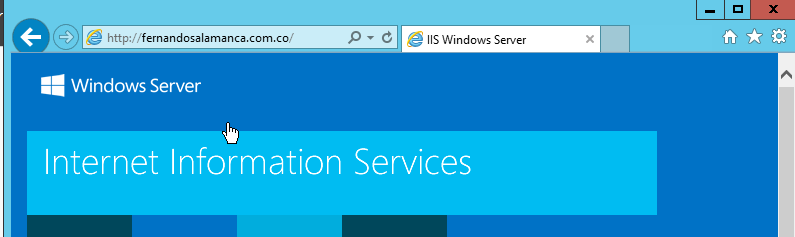

## Configuración previa
### Establecer IP estatica
Estando ya en el sistema operativo, nos dirigimos a las conexiones de red

Ingresamos al **Estado de Ethernet**

Nos dirigimos a las propiedades de este e ingresamos a **Protocolo de Internet versión 4(TCP/IPv4)**

Estando en la ventana de propiedades definimos la dirección IP estatica **192.168.17.2**, que también queda igual para el **Servidor DNS** y la puerta de enlace sería **192.168.17.1**

### Active Directory
*"Un directorio es una estructura jerárquica que almacena información sobre objetos en la red. Un servicio de directorio, como Active Directory Domain Services (AD DS), proporciona los métodos para almacenar datos de directorio y poner dichos datos a disposición de los usuarios y administradores de la red. Por ejemplo, AD DS almacena información acerca de las cuentas de usuario, como nombres, contraseñas, números de teléfono, etc., y permite que otros usuarios autorizados de la misma red tengan acceso a dicha información."*
[Articulo Microsoft](https://learn.microsoft.com/es-es/windows-server/identity/ad-ds/get-started/virtual-dc/active-directory-domain-services-overview)  

Abrimos nuestro **Administrador del Servidor**, estando en este nos dirigimos a la barra de navegación y desplegamos el menú de la pestaña **Administrar**. Elegimos **Agregar roles y caracteristicas**.

En el asistente para agregar roles y caracteristicas seleccionamos **Servicios de domimio de Active Directory**

Agregamos las caracteristicas adicionales a este que nos indica el mismo asistente y le damos en instalar.

Una vez instalado se van a requerir pasos adicionales para que la maquina pueda ser un controlador de dominio. Para solo tenemos que dar click en el texto de **Promover este servidor a controlador de dominio**

En la confifuración de la implementación seleccionamos **Agregar un nuevo bosque** e ingresamos un nombre de dominio raiz.

Establecemos una contraseña para la restauración de servicios de directorio (DSRM)

Podemos cambiar o dejar el **Nombre de dominio NetBIOS** asignado al dominio. Teniendo en cuenta siempre que este no debe superar los **15 caracteres**.

Una vez comprobado lo hecho en los pasos anteriores ya podemos iniciar la instalación

Luego de reiniciar, en el inicio de sesión veremos el nombre de NetBIOS anteponer al usuario administrador, pero para estar completamente seguros de que todo quedó instalado podemos hacer uso del comando **Get-ADDomain** en PowerShell
### IIS (Internet Information Service)
IIS es un servidor web de Microsoft que se ejecuta en sistemas operativos Windows, en este caso en Windows Server 2012 R2. Se utiliza para intercambiar contenido web dinámico y estático con usuarios de Internet. IIS también se puede utilizar para administrar, implementar y alojar aplicaciones web utilizando tecnologías como PHP y ASPNET. 

Nuevamente abrimos nuestro **Administrador del Servidor**, estando en este nos dirigimos a la barra de navegación y desplegamos el menú de la pestaña **Administrar**. Elegimos **Agregar roles y caracteristicas**.

Seleccionamos **Servidor web (IIS)**

Agregamos caracteristicas adicionales a este servidor

Dejamos los servicios de rol que nos marca por defecto

Luego instalamos

Finalmente si vamos al Administrador de IIS, mediante un página creada por defecto podemos comprobar que el dominio que ingresamos en el Active Directory funciona. Para esto elegimos la opción de __Examinar*:80(http)__

Esto nos redirecciona al localhost, pero si ingresamos a *http://fernandosalamanca.com.co* veremos el mismo contenido.
