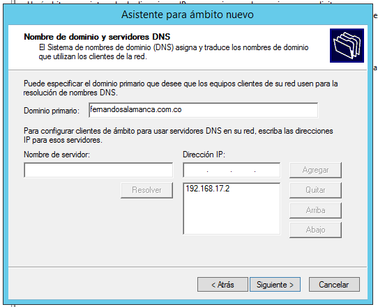

## Servidor DHCP
_"Cada dispositivo de una red basada en TCP/IP debe tener una dirección IP de unidifusión única para acceder a la red y sus recursos. Sin DHCP, las direcciones IP de los equipos nuevos o de los equipos que se mueven de una subred a otra deben configurarse manualmente, mientras que las direcciones IP de los equipos que se quitan de la red deben recuperarse manualmente"._

_"Con DHCP, todo este proceso está automatizado y se administra de forma centralizada. El servidor DHCP mantiene un grupo de direcciones IP y concede una dirección a cualquier cliente habilitado para DHCP cuando se inicia en la red. Dado que las direcciones IP son dinámicas (concedidas) en lugar de estáticas (asignadas permanentemente), las direcciones que ya no están en uso se devuelven automáticamente al grupo para la reasignación"._

[Articulo de Microsoft](https://learn.microsoft.com/es-es/windows-server/networking/technologies/dhcp/dhcp-top)
 
Nuevamente abrimos nuestro **Administrador del Servidor**, estando en este nos dirigimos a la barra de navegación y desplegamos el menú de la pestaña **Administrar**. Elegimos **Agregar roles y caracteristicas**.

Seleccionamos **Servidor DHCP**

Agregamos las caracteristicas adicionales

Una vez finalizada la instalación, damos click en **Completar configuración de DHCP**

Estando en el *Asistente posterior a la instalación de DHCP* damos **Siguiente**

En la pestaña de **Autorización** verificamos que se haga referencia al usuario administrador y damos en **Confirmar**

Ahora nos dirigimos al **Administrador de DHCP**, y en la pestaña de **IPv4** creamos un **Ámbito nuevo**

En el **Asistente para ámbito nuevo** especificamos un nombre y una descripción a este.

Ingresamos el intervalo de direcciones del ámbito, desde **192.168.17.100** hasta **192.168.17.254**

Dejamos la **Duración de la concesión** por defecto, que son 8 días.

Ingresamos la IP de puerta de enlace que previamente habiamos definido **192.168.17.1**

Verificamos el dominio y la IP a la que hace referencia.

Ya con eso podemos finalizar.