## Servidor DNS
_"Los servidores DNS convierten las solicitudes de nombres en direcciones IP, con lo que se controla a qué servidor se dirigirá un usuario final cuando escriba un nombre de dominio en su navegador web. Estas solicitudes se denominan consultas."_
[¿Qué es DNS?](https://aws.amazon.com/es/route53/what-is-dns/#:~:text=Los%20servidores%20DNS%20convierten%20las,Estas%20solicitudes%20se%20denominan%20consultas.)
 
Si hasta el momento todo se ha seguido en orden, en el proceso de instalación del Active Directory se tuvo que haber instalado DNS, por lo que solo tendríamos que configurarlo.  

Ingresamos al **Administrador de DNS**
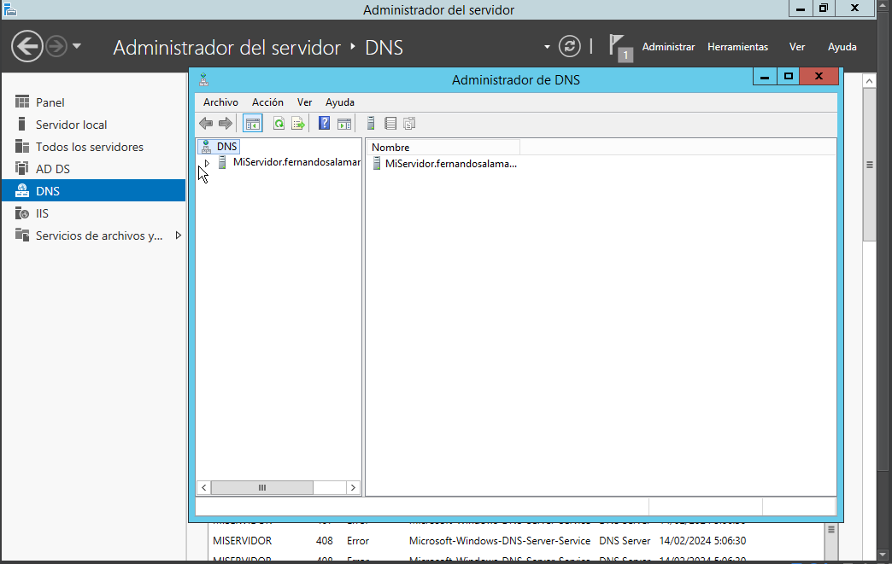
En el menú lateral ingresamos a **Zonas de busqueda directa**, ingresamos a nuestro dominio y seleccionamos la opción de **Host Nuevo**
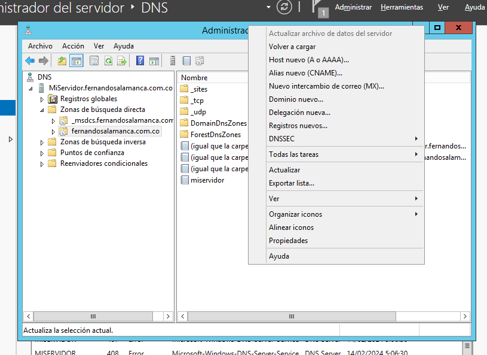
Especificamos un nombre la dirección IP **192.168.17.2**
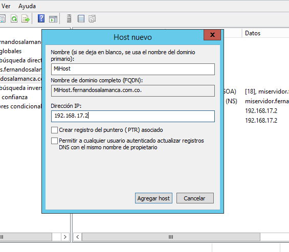
Posteriormente en **Zonas de busqueda inversa** vamos a **Zona nueva**
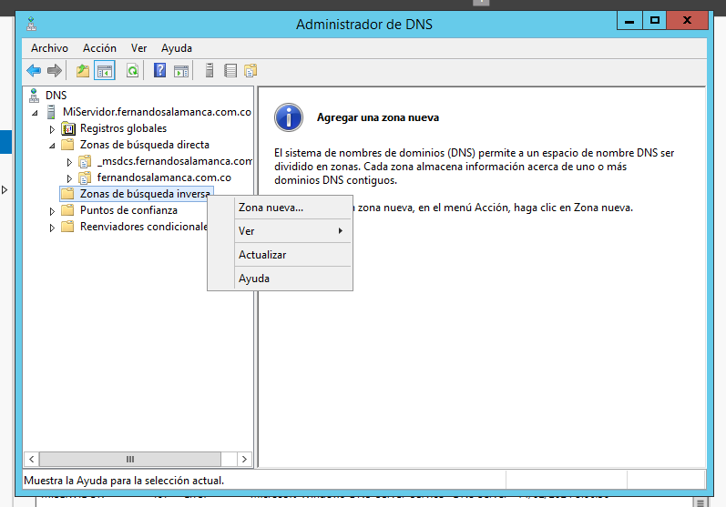
En el **Asistente para nueva zona** avanceremos con lo que nos da por defecto
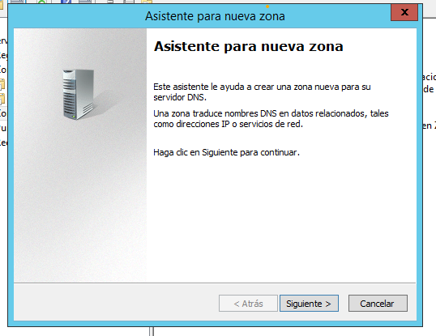
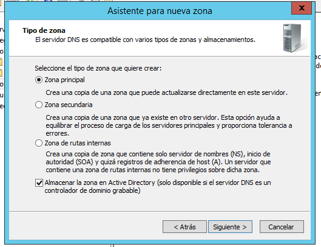
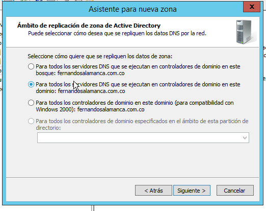
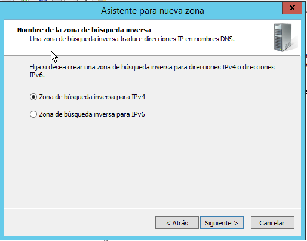
Acá especificamos los tres primeros octetos de nuestra dirección IP **192.168.17.**
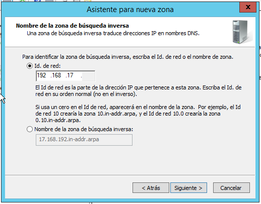
En esta parte es importante seleccionar **No adminitr actualizaciones dinámicas**, ya que como colocamos la dirección IP de forma estatica al servidor DNS no queremos que esta cambie.
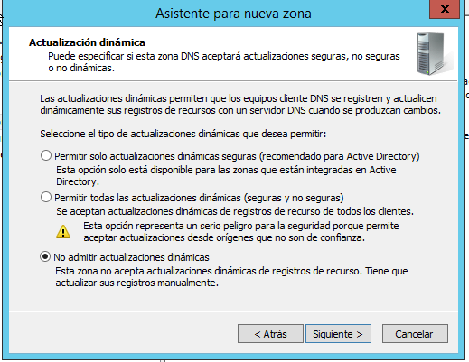
Ya con esto finalizamos.
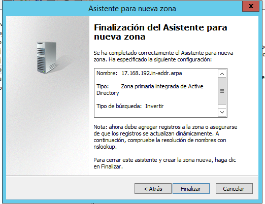
Seleccionamos la zona que acabamos de crear y seleccionamos **Nuevo Puntero (PTR)**
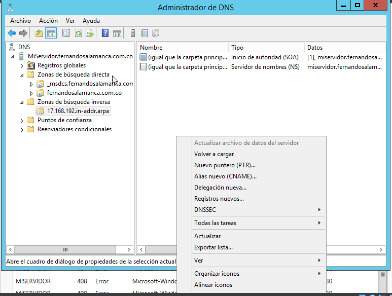
Seleccionamos el host previamente creado
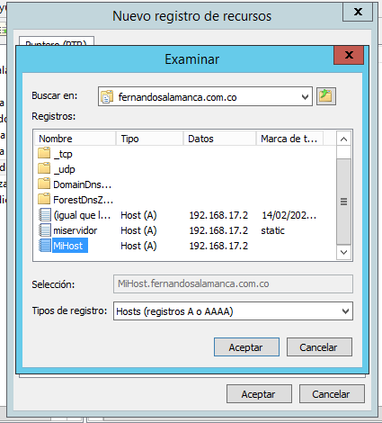
Comprobamos que todo esté en orden, y damos **Aceptar**.
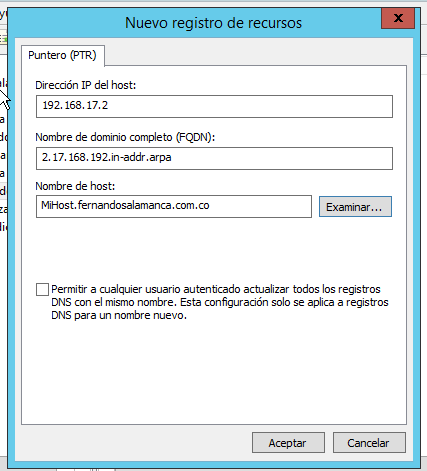