## Servidor FTP
_"Los servidores de FTP son aplicaciones de software que posibilitan la transferencia de archivos de un dispositivo (es decir, una computadora con Mac, Windows o Linux) a otro. Puede parecer complicado, pero los servidores del FTP son simplemente computadoras que tienen una dirección del FTP y se dedican a recibir conexiones del FTP. Realizan dos simples tareas: “obtener” y “poner”."_
[¿Qué es FTP?](https://experience.dropbox.com/es-la/resources/what-is-ftp)
 
Nuevamente abrimos nuestro **Administrador del Servidor**, estando en este nos dirigimos a la barra de navegación y desplegamos el menú de la pestaña **Administrar**. Elegimos **Agregar roles y caracteristicas**.

Dentro del apartado de **Servidor IIS** encontramos el **Servidor FTP**, lo seleccionamos.
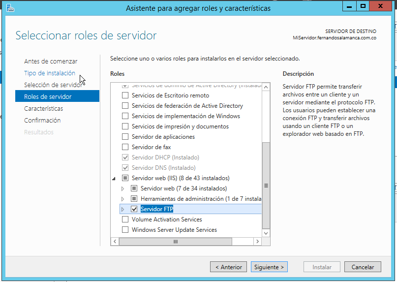
Luego en la pestaña de **Herramientas** del Administrador del Servidor, elegimos la opción de **Usuarios y equipos de Active Directory**
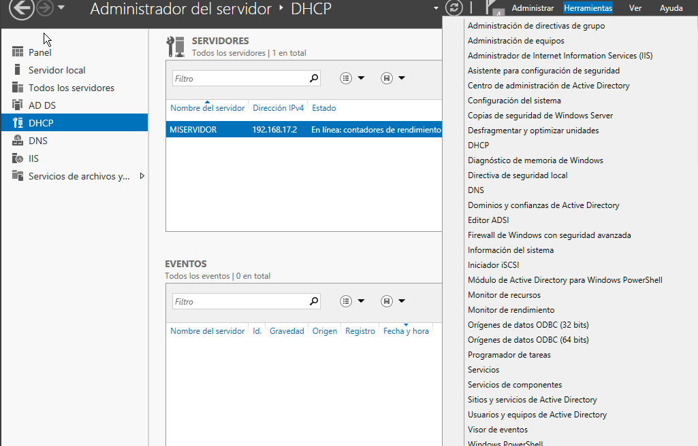
Creamos una **Unidad organizativa**
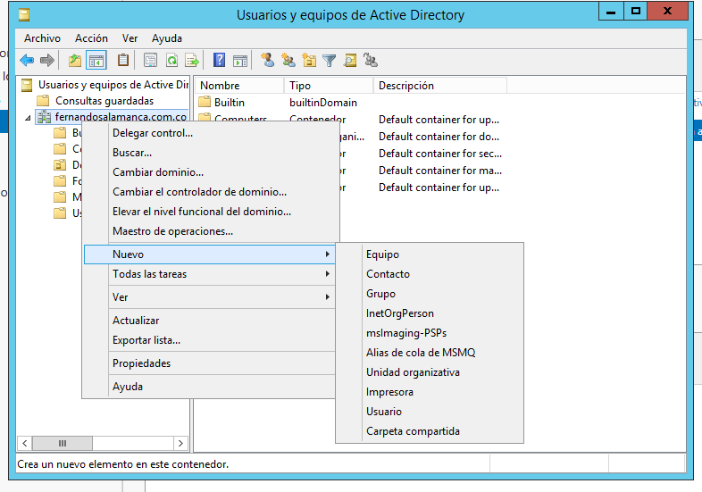
La nombramos FTP
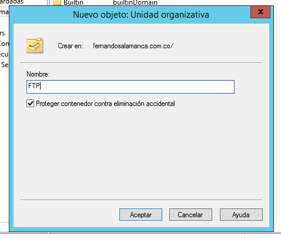
Ya dentro de esta podemos crear usuarios
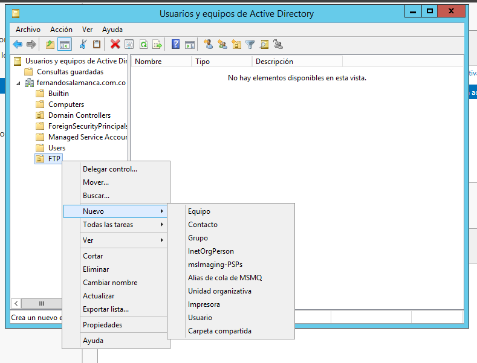
Especificamos un nombre de pila y de inicio de sesión de usuario
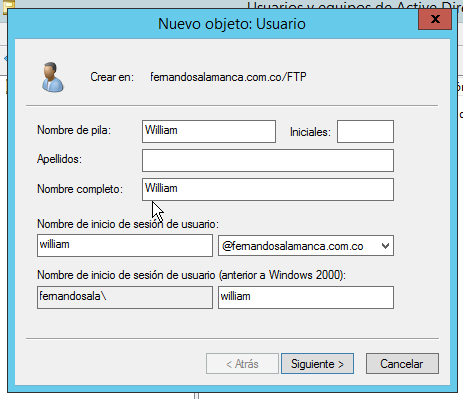
Podemos elegir, de acuerdo a una contraseña ingresada, si esta nunca expirará, si el usuario nunca la puede cambiar, si el usuario cambia la contraseña en el siguiente inicio de sesión o si deshabilitamos directamente la cuenta.
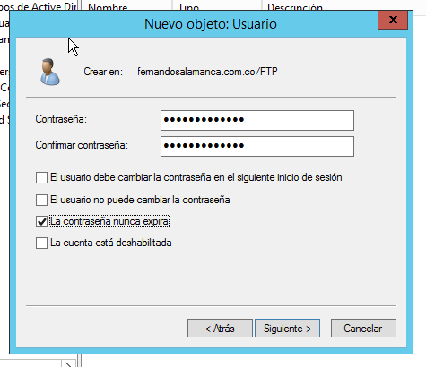
Podemos ver los usuarios creados
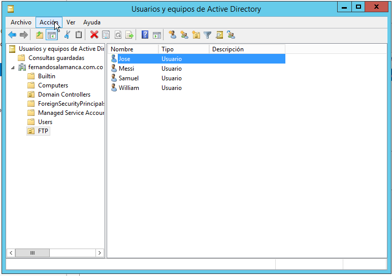
Creamos un grupo en el cual podemos agregar a los usuarios que queramos de los que acabamos de crear
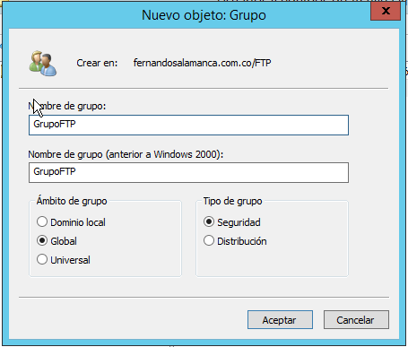
Podemos agrager más o quitar cuando queramos.
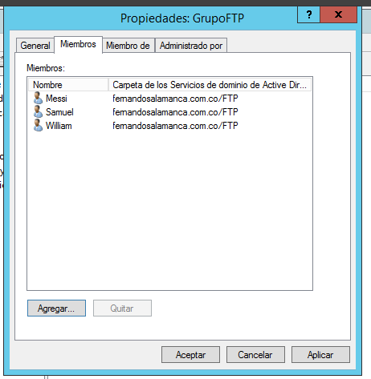

En la carpeta **inetpub** del disco local, creamos una carpeta, y a esta le editamos los permisos, de tal forma que solo los usuarios o grupos que especifiquemos puedan interactuar con esta.
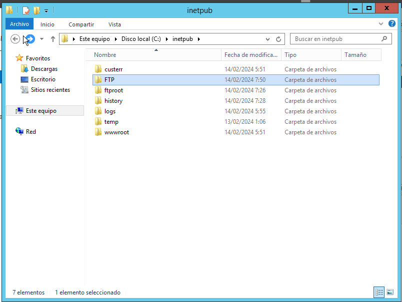
En las propiedades de la carpeta, en la pestaña de seguridad, vamos a **Opciones avanzadas**
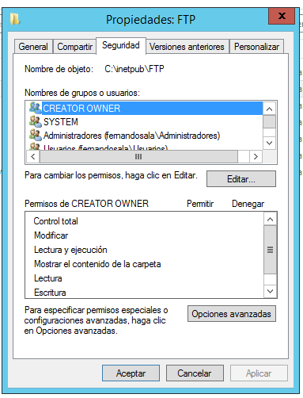
Damos en **Deshabilitar herencia**
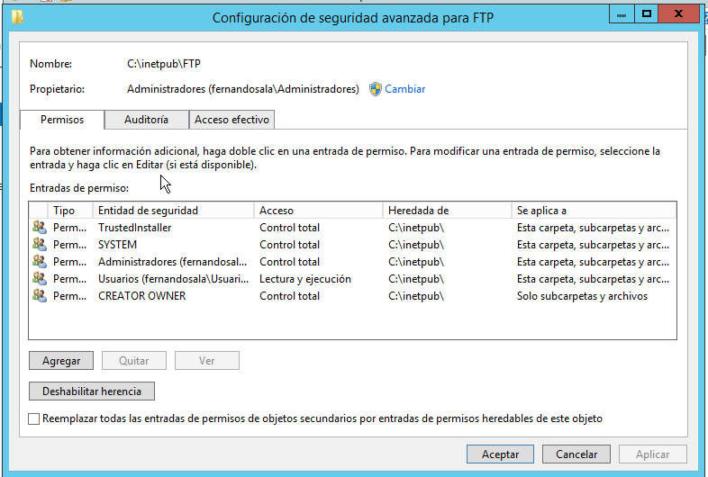
Seleccionamos la opción de **Convertir los permisos heredados en permisos explicitos en este objeto**
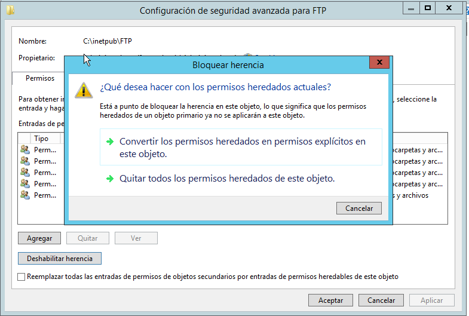
Damos **Aceptar**. Ya devuelta a este menú hacemos click en **Editar**

Agregamos el grupo previamente creado
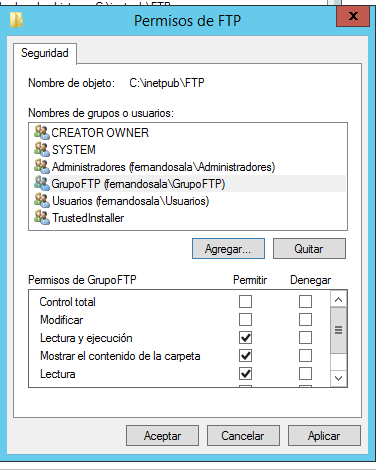
Desde el Administrador de IIS seleccionamos **Agregar sitio FTP**
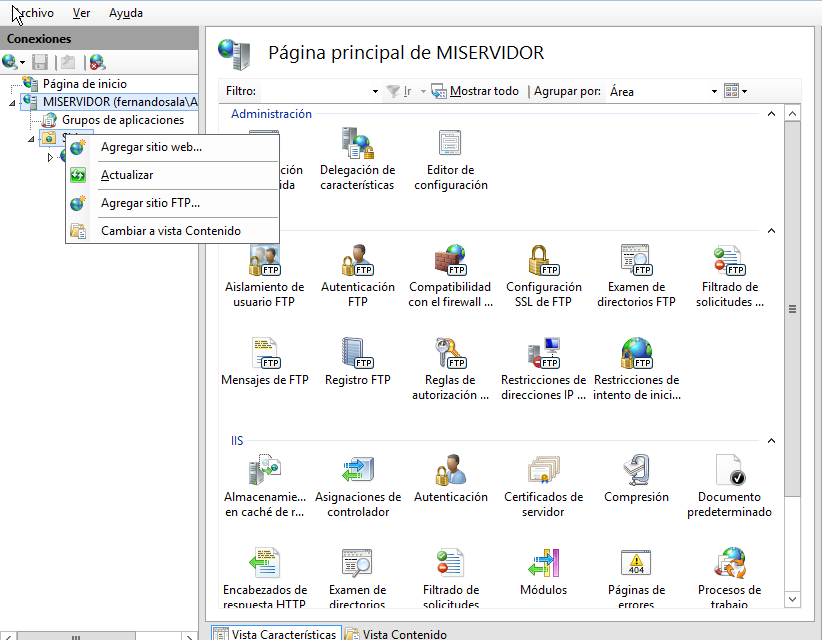
Le damos un nombre y le indicamos la ruta de la carpeta a la que previamente le habiamos modificado el acceso
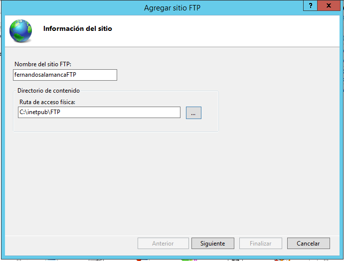
Especificamos nuestra IP **192.168.17.2**, además del puerto que siempre se maneja para FTP **21**. Aunque recomendado, de momento no usaremos **SSL**
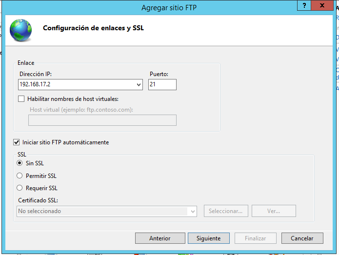
Indicamos **Autenticación básica**, en **Autorización** le permitimos el acceso solamente a **Roles o grupos de usuarios especificados**, seguido a eso colocamos el nombre del grupo en este caso **GrupoFTP** con permisos de lectura.
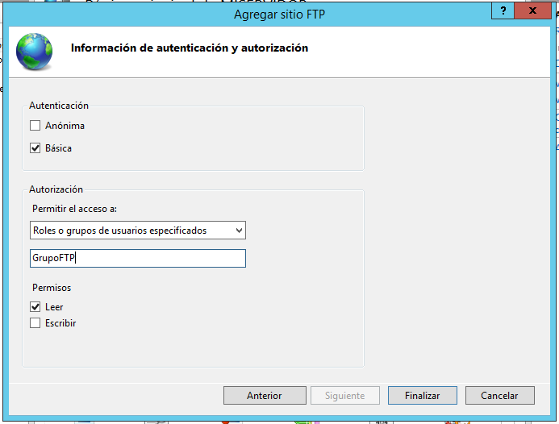