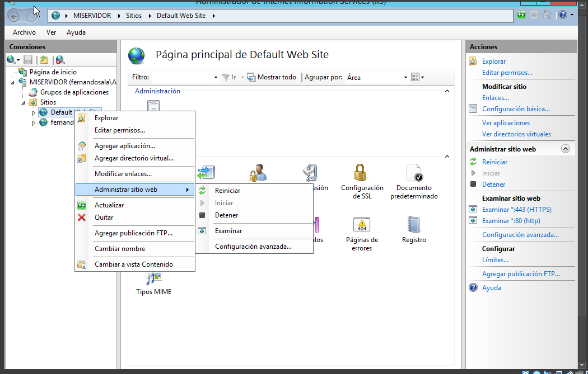
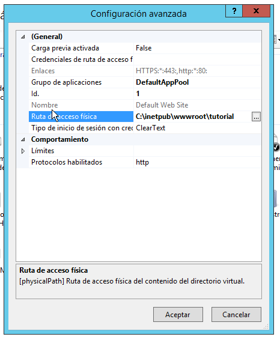

## Página web HTTP
En el **Administrador de IIS**, en la pestaña de **Sitios**, en página que nos sale por defecto, vamos a **Administrar sitio web** y luego a **Configuración avanzada**

Estando ahí unicamente modificamos la ruta de acceso fisica de nuestra página
