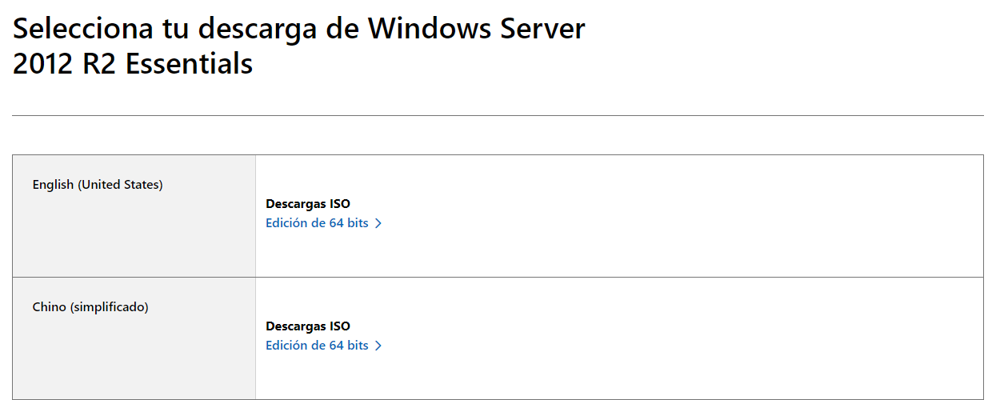
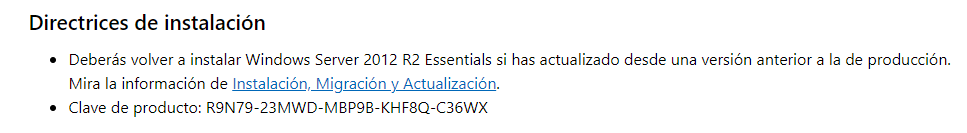
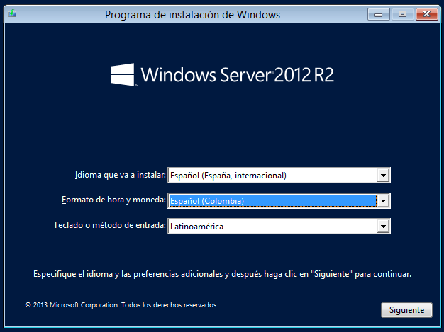

# Tutorial Windows Server 2012-R2
1. Instalación
2. Configuración previa
3. DNS
4. DHCP
5. FTP
6. SMTP
7. HTTP
## Instalación
### VirtualBox
En esta practica se hizo uso del software de virtualización [VirtualBox](https://www.virtualbox.org/), especificamente la versión 7.0, pero se pudo haber hecho uso de otro software de virtualización. El proceso de descarga e instalación de este, junto a otras consideraciones, se encuentra especificados en esta misma página. En caso de duda o inconveniente se recomienda revisar esta página.  

 
### ISO Windows Server 2012-R2
La página oficial de [Microsoft](https://www.microsoft.com/es-es/evalcenter/download-windows-server-2012-r2-essentials) nos provee de enlaces de descarga de imagenes de este sistema operativo en varios idiomas, elegimos alguno de estos y lo descargamos.
 
Adicional a esto es importante revisar las directrices de instalación, ya que en estas encontraremos la clave de producto que posteriormente necesitaremos ingresar en el proceso de instalación del sistema operativo.

### Instalando el sistema operativo
VirtualBox en el momento de cargar la ISO del sistema operativo nos define un minimo recomendado de 2GB de RAM y 50GB de disco duro. Una vez levantada la maquina virtual nos aparacerá la venta de instalación de Windows Server 2012

Aceptamos terminos y condiciones, seleccionamos una instalación personalizada e instalamos. Finalmente solo queda definir una contraseña al **Administrador del sistema**.