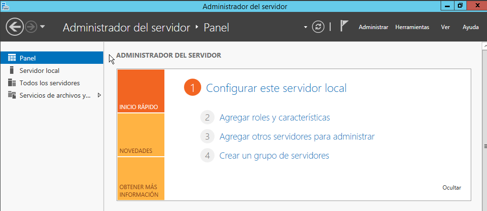

## Servidor SMTP
_"Un servidor SMTP, también conocido como servidor de correo saliente, es una computadora o un software que administra los mensajes del correo electrónico salientes. En general, un servidor de correo se refiere a un sistema que recopila, administra y envía correos electrónicos. Un servidor SMTP se refiere específicamente al componente del servidor de correo que utiliza el protocolo simple de transferencia de correo (SMTP) para enviar correos salientes. Mientras que el servidor de correo administra los correos electrónicos entrantes y salientes, el servidor SMTP se ocupa solo de enviar y retransmitir los correos electrónicos salientes a los destinos apropiados. También puede denominarse servidor de correo electrónico saliente"._
[¿Qué es SMTP?](https://aws.amazon.com/es/what-is/smtp/)
 
Nuevamente abrimos nuestro **Administrador del Servidor**, estando en este nos dirigimos a la barra de navegación y desplegamos el menú de la pestaña **Administrar**. Elegimos **Agregar roles y caracteristicas**.

En la pestaña de **Caracteristicas** seleccionamos **Servidor SMTP**

Agregamos caracteristicas adicionales.

Finalizada la instalación nos dirigimos a **Herramientas** de la barra de navegación del **Administrador de Servidor** y seleccionamos **Administrador de Information Services (IIS) 6.0**

Nos vamos a **Servidor virtual SMTP...**

Le damos un nombre

Seleccionamos nuestr IP **192.168.17.2**

Le indicamos la ruta del directorio principal de subdirectorios para contenido SMTP

Ingresamos nuestro dominio

Como tenemos que gestionar el envio de correos por POP3, descargamos e instalamos **Visendo SMTP Extender Communnity**

Aceptamos terminos

Le damos un nombre y en **Organization** ingresamos nuestro dominio

Una vez instalado, podemos verificar que nuestra IP aparece asociada

Para crear una cuenta solo ingresamos una dirección de correo y una contraseña

En este panel podemos ver las cuentas creadas

Instalamos Foxmail

Cuando lo ejecutamos tenemos que elegir **Other MailBox**

Creamos una cuenta con nuestro dominio

